author: VaiVoa
summary: Documentação de APIs com o Readme
id: docs
categories: codelabs,markdown
environments: Web
status: Published
feedback link: https://github.com/Vaivoa/doc-api-readme/issues
analytics account: Google Analytics ID

# Documentação de APIs com o Readme
## Antes de Começar
Duration: 1:28

Já encerrou o desenvolvimento de suas APIs e precisou apresentar os resultados para algumas dessas pessoas? 
* Cliente;
* Novos desenvolvedores que precisam entender a regra de negócio, ou mesmo para a
* Comunidade externa, de maneira pública.

Com certeza a resposta será “sim” para pelo menos um desses. Então vem a sua mente usar o Swagger, e é isso, lá já temos os endpoints, com os verbos HTTP, os tipos de parâmetros, até mesmo autenticação. E sim, essa é uma ferramenta incrível, não temos dúvida. 

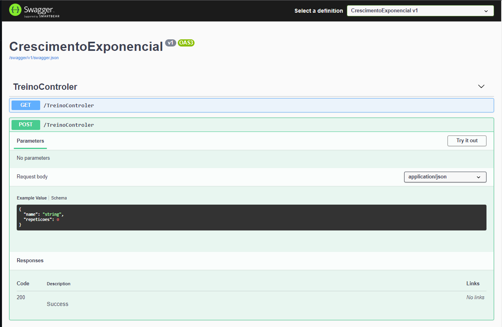

Mas e se você quisesse deixar claro a regra de negócio da sua API? Se fosse do seu interesse que quem estivesse fazendo chamadas para sua aplicação entendesse o porquê das coisas? Já sei, você pensaria em criar um blog explicando esses pontos? Ok, compreensível, mas lá do seu blog você permitirá que sejam feitas requisições para sua API? 

Aqui temos uma alternativa que facilita a apresentação do backend de maneira mais amigável, possibilita a geração de requisições para seus endpoints em diversas linguagens de programação e ainda fornece métricas sobre a utilização de sua documentação. Essa alternativa chama-se Readme. Nunca ouviu falar? Não tem problema, você vai poder acompanhar o tutorial mesmo assim.

E aí, ficou animado? Então vamos lá!

### O que você vai criar
* Uma documentação no Readme de um projeto .Net totalmente automatizada através de Github Actions ou Azure Pipelines.

### O que você vai aprender
- Configurar o pacote do Swagger no projeto .NET.
- Iniciar o SwaggerCli na solução.
- Documentar no readme.
- Automatizar o processo através da pipeline do Github Actions.
- Automatizar o processo através da pipeline do Azure Pipelines.

### O que é necessário
- Conhecimento básico de .Net e C#.
- Visual Studio 2019 ou posterior instalado na máquina.

## O projeto
Duration: 1:14

Eu sei, eu sei você já está ansioso para aprender como documentar sua API, mas vamos primeiro falar sobre o projeto que utilizamos para documentação. Trata-se de uma Web API em .NET Core 5, você pode acessar o [repositório no Github.](https://github.com/johnvitorconstant/CrescimentoExponencial) Como o foco desse tutorial é utilizar o readme.io, vamos passar brevemente sobre a estrutura do projeto:

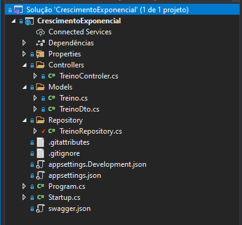

Temos aqui uma camada de Models onde se encontram as classes Treino e o DTO que será utilizado na requisição. Para fins didáticos utilizamos uma classe TreinoRepository que serve somente para fornecer uma lista de Treinos para os endpoints que se encontram na Camada Controllers. Vamos então ver o que há nos nossos endpoints:

```csharp
[ApiController]
[Route("[controller]")]
public class TreinoControler : ControllerBase
{
	private readonly TreinoRepository _repository;

  public TreinoControler(TreinoRepository repository)
  {
	  _repository = repository;
  }

 [HttpGet]
 public  IActionResult ObterTodosTreinos()
 {
	 return Ok(_repository.ObterTodos());
 }

 [HttpPost]
 public IActionResult NovoTreino(TreinoDto treinoDto)
 {
	 Treino treino = new Treino(treinoDto.Name, treinoDto.Repeticoes);
	 _repository.InserirTreino(treino);        
   return Ok(treino);
 }
}
```

Como vamos precisar acessar a lista de Treinos, precisamos injetar o TreinoRepository no construtor da nossa Controller, lembrando que isso só foi possível porque fizemos o registro do repositório na nossa Startup.cs:

```csharp
public void ConfigureServices(IServiceCollection services)
{
  ...
	services.AddSingleton<TreinoRepository>();
}
```

Nossos dois *endpoints* usam os verbos *GET* e *POST* do protocolo *HTTP,* portanto com o método *ObterTodosTreinos* listamos todos os itens de Treino e com o método *NovoTreino* inserimos novos itens à lista.

Na página seguinte damos início à configuração do Swagger

## Configurando o Swagger no projeto
Duration: 4:10

Inicialmente devemos instalar o pacote do Swashbuckle.AspNetCore (Swagger) no projeto da API da solução. Para o .Net5, deve-se utilizar a versão 5.6.3 do Swashbucke.AspNetCore (para o .Net6 deve-se utilizar a versão 6.2.3):

```xml
<Project Sdk="Microsoft.NET.Sdk.Web">
	...
	<ItemGroup>
		<PackageReference Include="Swashbuckle.AspNetCore" Version="5.6.3" />
	</ItemGroup>
	...
</Project>
```

Uma possibilidade adicional do Swagger é a adição de um arquivo .xml que facilita documentar cada endpoint, para gerar este arquivo .xml na compilação do projeto basta adicionar o seguinte parâmetro no Property Group do .csproj:

```xml
...
<PropertyGroup>
	<GenerateDocumentationFile>True</GenerateDocumentationFile>
</PropertyGroup>
...
```

Uma vez instalado o pacote, devemos inicializar a configuração do Swagger na Startup do projeto:

```chsarp
app.,public void ConfigureServices(IServiceCollection services)
{
		...
    services.AddSwaggerGen(c =>
            {
                c.SwaggerDoc("v1", new OpenApiInfo
                {
                    Title = "CrescimentoExponencial",
                    Version = "v1"
                });
                c.SwaggerGeneratorOptions.Servers =
                    new List<OpenApiServer> {
                    new OpenApiServer {Url = "https://localhost:5001" },
                    new OpenApiServer {Url = "https://localhost:44395" },
                    new OpenApiServer {Url = "http://www.customdomain.com" }
                    };
                string xmlFile = $"{Assembly.GetExecutingAssembly().GetName().Name}.xml";
                var filePath = Path.Combine(System.AppContext.BaseDirectory, xmlFile);
                c.IncludeXmlComments(filePath);
            });
			...
}
```

Onde List<OpenApiServer> é a lista que contempla as diversas url que podem estar no projeto (Produção, Desenvolvimento, Stagging, etc)

E c.IncludeXmlComments(filePath) aponta para localização física do .xml gerado na compilação

Finalmente devemos configurar o middleware do Swagger.

```chsarp
// This method gets called by the runtime. Use this method to configure the HTTP request pipeline.
public void Configure(IApplicationBuilder app, IWebHostEnvironment env)
{
	...
  app.UseSwagger();
  app.UseSwaggerUI(c => 
	c.SwaggerEndpoint("/swagger/v1/swagger.json", "CrescimentoExponencial v1"));
  ...
}
```

Uma vez adicionado a criação do xml na compilação do projeto, basta comentar as Models e Controllers com as tags de xml, como demonstrado nos exemplos abaixo:

```chsarp
public class TreinoDto
    {
        ...
        /// <example>
        /// Supino reto
        /// </example>
        public string Name { get; set; }

        /// <example>
        /// 15
        /// </example>
        public int Repeticoes { get; set; }
				...
    }
```

```chsarp
public class TreinosController : ControllerBase
    {
				...
        /// <summary>
        /// Obter todos os treinos
        /// </summary>
        /// <returns></returns>
        [HttpGet]
        public async Task<IActionResult> ObterTodosTreinos()
        {
            return Ok(_repository.ObterTodos());
        }

        /// <summary>
        /// Cadastra novo treino
        /// </summary>
        /// <param name="treinoDto"></param>
        /// <returns></returns>
        [HttpPost]
        public async Task<IActionResult> NovoTreino(TreinoDto treinoDto)
        {
            Treino treino = new Treino(treinoDto.Name, treinoDto.Repeticoes);
            await _repository.InserirTreino(treino);
            return Ok(treino);
        }
				...
    }
```

Após a devida instalação do swagger, ao rodar o programa ele irá exibir esta interface no https://localhost:5001/swagger

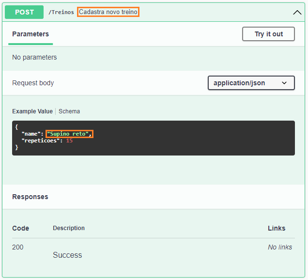

## Iniciando o SwaggerCli na solução
Duration: 0:32

O SwaggerCli é uma ferramenta que permite gerar o .json do swagger2.0 ou OpenAPI3.0 na compilação do projeto. 

Para instalar a ferramenta inicialmente devemos criar o arquivo de manifesto na raiz da solução.

```bash
dotnet new tool-manifest
```
Uma vez criado o arquivo de manifesto, podemos instalar a ferramenta Swashbuckle.AspNetCore.Cli (para o .Net6 deve-se utilizar a versão 6.2.3):

```bash
dotnet tool install --version 5.6.3 Swashbuckle.AspNetCore.Cli
```

Uma vez instalado o Swashbuckle.AspNetCore.Cli, devemos especificar em nosso projeto que o swagger.json deve ser criado e atualizado todas as vezes que o projeto for compilado:

```xml
<Target Name="PostBuild" AfterTargets="PostBuildEvent">
		<Exec Command="dotnet tool restore" />
		<Exec Command="dotnet swagger tofile --output swagger.json $(OutputPath)\$(AssemblyName).dll v1" />
</Target>
```

Com isto já temos o swagger.json pronto para ser utilizado no readme.com

## Documentando no Readme
Duration: 1:57

Efetue o seu cadastro na plataforma aqui, após o registro você pode realizar login e terá acesso a uma página como esta:

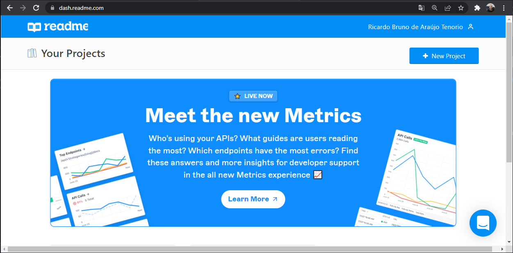

Para criar um projeto é só clicar no botão + New Project, e agora é só preencher o formulário com o nome do projeto e clicar em Create. Podemos então fazer o upload do nosso json para a plataforma e estará tudo devidamente documentado. Na tela seguinte navegue para Import Your API:

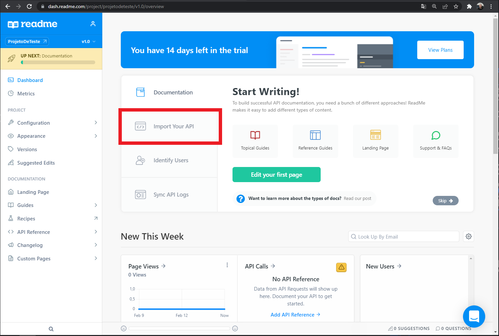

Surgirá a tela abaixo, é só clicar em OpenAPI Upload:

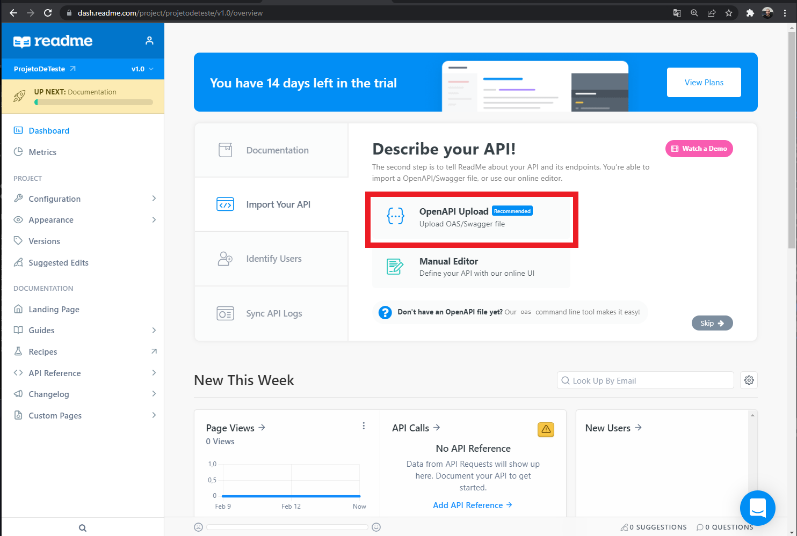

Na próxima imagem irá aparecer diversas opções: github, commandline, url, file:

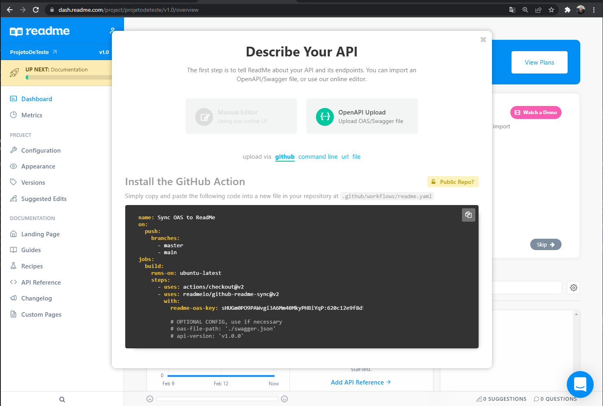

No próximo passo iremos abordar a implementação no **Github Actions** e posteriormente uma medotologia para adicionar à **Azure Pipelines**.

## GitHub Actions
Se você está usando o **Azure Pipelines** vá para a próxima parte deste guia.

Entre as opções de formas de realizar o upload, vamos dar destaque ao Github Actions, ainda que você nunca tenha criado uma pipeline antes, para a finalidade de usar essa ferramenta, você não precisa se preocupar pois você tem somente que copiar e colar o código que eles exibem na tela para um arquivo yaml.


Para isso crie, na raiz do projeto, uma pasta com o nome .github e a subpasta workflows. Dentro desta subpasta crie o arquivo readme.yml (o nome tanto faz, desde que a extensão seja .yml ou .yaml) e cole. Neste arquivo, cole o conteúdo que aparece na imagem acima, e você deve ter o resultado como na figura abaixo:


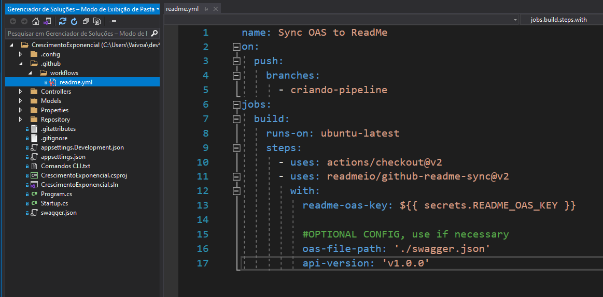

#### 🚨 ATENÇÃO 🚨

Se o seu repositório no Github for público não exponha a sua readme-oas-key, aqui nós usamos Secrets do Github. Isso também é simples de se fazer, vejamos como realizar o cadastro de uma secret em um repositório remoto:


Navegando para aba Settings e em seguida clicando em Secrets, clique em Actions, aparecerá a tela a seguir, agora clique em New Repository Secret:

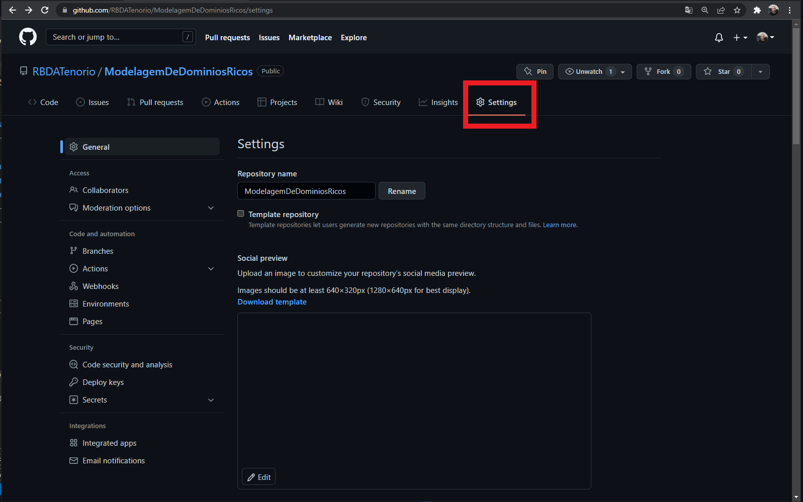

No campo Name digite README_OAS_KEY e no campo Value cole o valor da chave que aparece no seu arquivo readme.yml, agora clique em Add Secret e está feito. Se estiver achando confuso, nessa página clique em Public Repo? E o arquivo já virá configurado para usar Secrets. 

#### 🚨 ATENÇÃO 🚨

Altere o nome da branch no arquivo readme.yml para os nomes das suas branches no Github, nesse nosso caso, ao se fazer um push na branch criando-pipeline para o repositório remoto, copiaremos automaticamente o arquivo swagger.json para nosso projeto no Readme.

## Azure Pipelines
E se você estiver usando o Azure DevOps e quiser fazer a publicação da documentação pelo Azure Pipelines? Não há com o que se preocupar, vamos ver como essa tarefa também pode ser simplificada.

Admitindo que você já está com seu repositório criado, crie uma `Pipeline`:

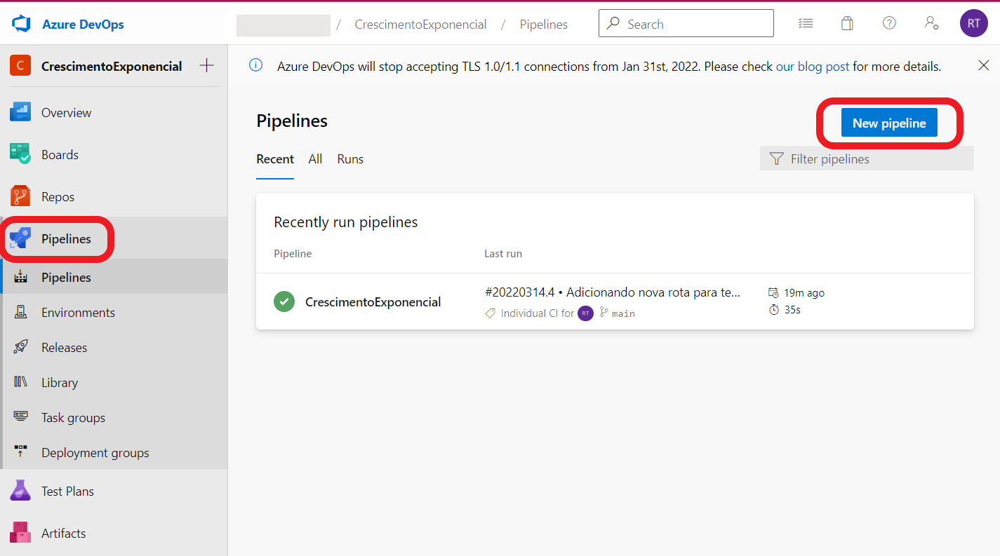

Informe onde está o seu código, nesse caso, apenas como exemplo utilizamos o próprio repositório do Azure DevOps:

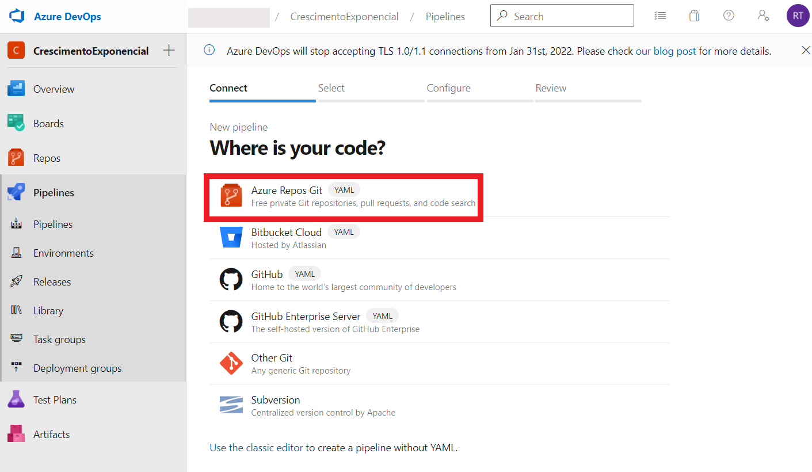

Em seguida escolha o repositório desejado. Será fornecida uma lista de opções de templates de arquivos yml: 

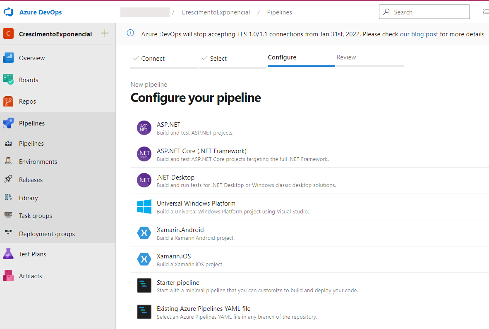

Você pode escolher o template [ASP.NET](http://ASP.NET) que vem com passos necessários para build e teste, ou usar a opção Existing Azure Pipelines YAML file. Independentemente do template que você escolher será necessário incluir os seguintes passos, após o estágio de build

```yaml
...

- task: NodeTool@0
  inputs:
    versionSpec: '16.x'

- script: |
    npm install rdme@latest -g
    rdme openapi --version=v1.0 --key=<Sua Chave No Repositorio Do Readme> --id=61fd6c561242981eca239782
  displayName: 'Running rmde cli'

...
```

A Task NodeTool@0 é necessária para usarmos o gerenciador de pacotes npm e instalar a CLI do Readme. O valor da flag --key deve ser o mesmo que aparece como readme-oas-key nessa [imagem](https://vaivoa.github.io/doc-api-readme/img//99ade375b726ea97.png). O --id é somente para identificar as alterações que você está fazendo no swagger.json, esse valor é arbitrário. Caso queira conferir como seria o arquivo inteiro, dá uma olhada aqui:

```yaml
trigger:
- main

pool:
  vmImage: ubuntu-latest

variables:
  buildConfiguration: 'Release'

steps:
- task: DotNetCoreCLI@2
  inputs:
    command: 'restore'
    projects: '**/*.csproj'
  displayName: 'Restore Nuget Packages'
 
- task: DotNetCoreCLI@2
  inputs:
    command: 'build'
    projects: '**/*.csproj'
    arguments: '--no-restore'
  displayName: 'Build projects'

- task: NodeTool@0
  inputs:
    versionSpec: '16.x'

- script: |
    npm install rdme@latest -g
    rdme openapi --version=v1.0 --key=<Sua Chave No Repositorio Do Readme> --id=61fd6c561242981eca239782
  displayName: 'Running rmde cli'
```

Depois disso, a cada push na branch main você terá atualização automática da sua documentação no Readme. 


## Conclusão
Ótimo trabalho! Você aprendeu sobre como documentar uma API .NET no Readme e como é fácil automatizar esta documentação direto na Pipeline do Github ou Azure.

Esperamos você no próximo vaivoa-codelabs.

### Resumo
- Instale o nu package no seu projeto.
- Instale a versão correta do SwaggerCli na solução do projeto.
- Configure o readme.com com através da própria GUI do site.
- Crie a rotina de automação através da Pipeline do serviço Git preferido.

### Saiba mais
- [readme.com](https://docs.readme.com/docs/getting-started-with-metrics)
- [Github Actions](https://docs.github.com/pt/actions)
- [Azure Pipelines](https://docs.microsoft.com/pt-br/azure/devops/pipelines/?view=azure-devops)